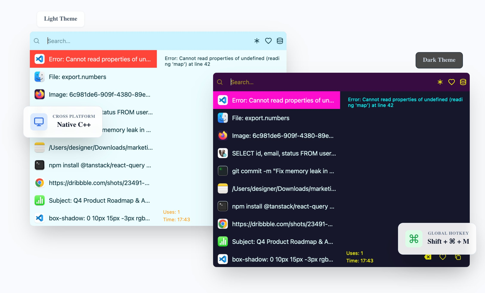

# CopyManager Pro - クロスプラットフォーム クリップボード管理ツール

CopyManager Pro はローカルファーストのプライバシーを重視したクリップボード管理ツールです。macOS、Windows、Linux で履歴管理と高速検索を提供します。

公式サイト: https://cpman.20480101.xyz

## スクリーンショット

## 主な機能

- Spotlight 風のグローバル検索: 最小限のフローティング検索ボックスで、必要なときに表示して作業を邪魔しません。
- ミリ秒級の高速検索: メモリのプリロードとキーワード組み合わせ（例: "code login"）で数分前から数か月前まで即検索。
- カスタムコマンド: Python / Shell / Node.js のスクリプトでクリップボード内容を処理。
- 即時テキスト変換: `>json` などのプレフィックスで整形・大小文字変換など。
- 効率ダッシュボード: 日・月・年単位の可視化統計。
- ストレージ管理: データベース/メディア使用量を明確化し、ワンクリックで整理。
- 充実したコンテンツ対応: プレーンテキスト、リッチテキスト、画像、ファイルパスを種類別に管理。
- 画像/ファイルの強化: サムネイル表示、ダブルクリックで原寸表示。ファイルコピーはパスを記録。
- バックアップと移行: 履歴と画像リソースのエクスポート/インポートで無損失移行。
- ローカルファーストのプライバシー: データは端末内に保存し、クラウドに送信しません。
- パーソナライズ: フルカラーのカスタマイズとテーマ。

## 主要ショートカット

- ウィンドウを開く: `Ctrl+Shift+M`（または `Cmd+Shift+M`）
- 貼り付けて自動的に非表示: `Enter`
- すぐ閉じる: `Esc`

## 想定ユーザー

- 頻繁にコピー/ペーストする開発者・デザイナー・運用・事務
- クロスプラットフォームの履歴管理と高速検索が必要なチーム
- プライバシーとローカル管理を重視するユーザー

## キーワード

クリップボード管理, クリップボード履歴, クロスプラットフォーム クリップボード, Clipboard Manager, macOS クリップボード, Windows クリップボード, Linux クリップボード, 生産性, CopyManager Pro
